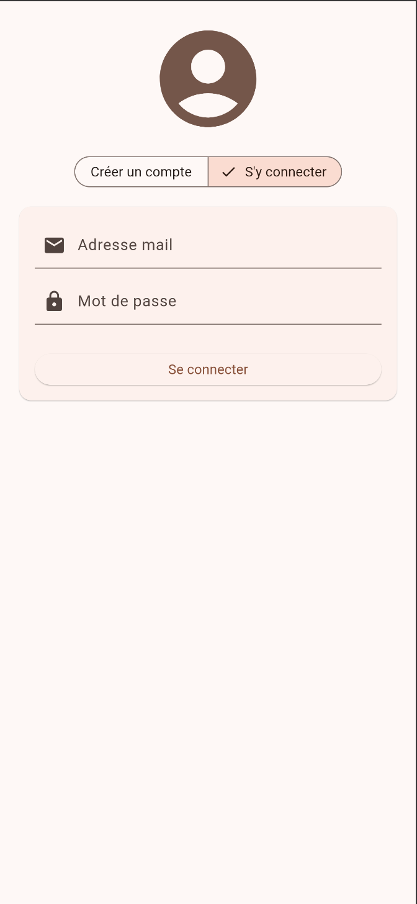
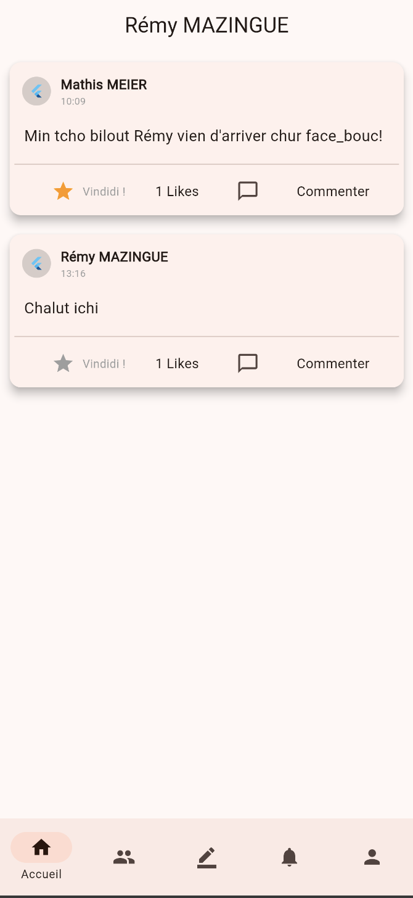
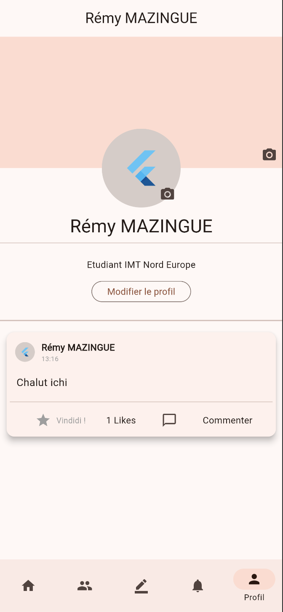
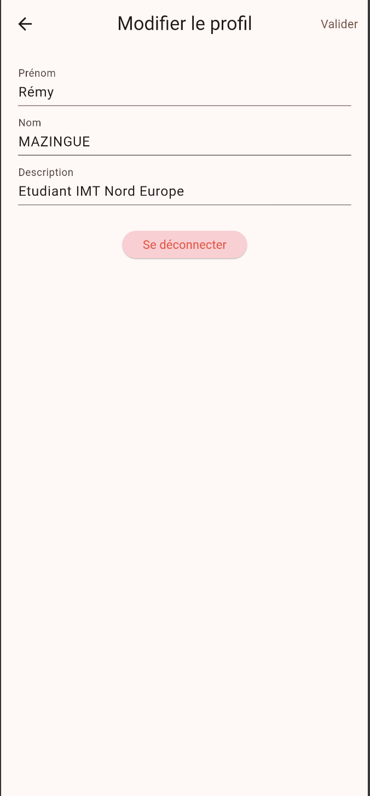
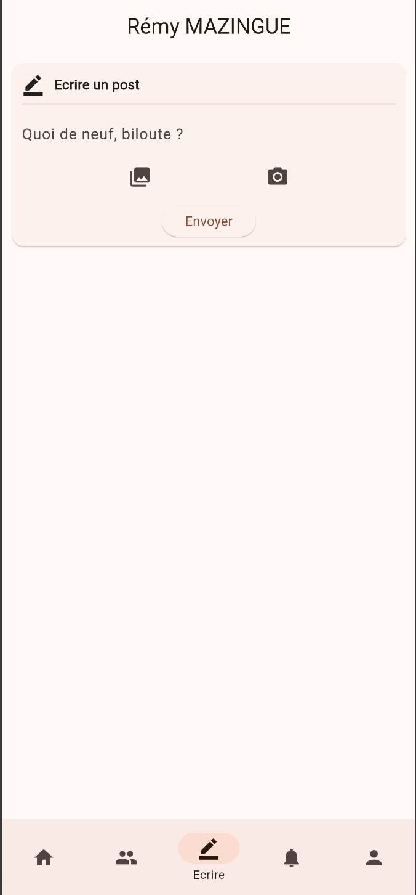
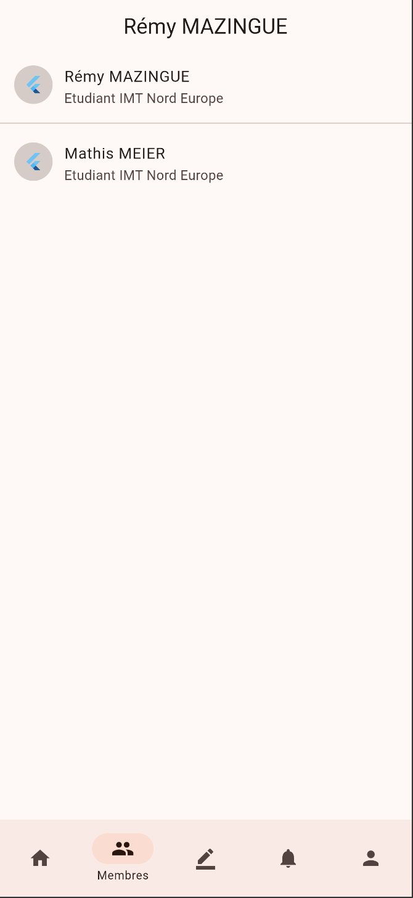
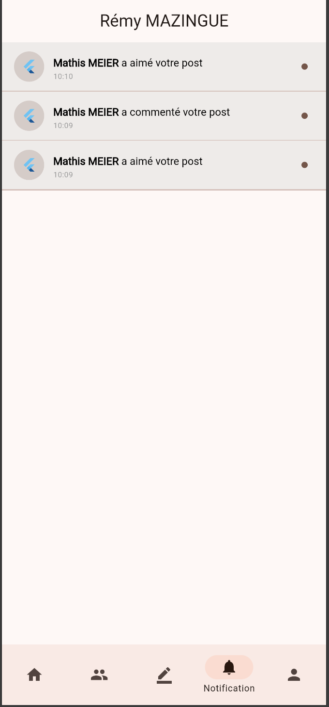

# Présentation du Projet : Cht'i Face Bouc

**Auteur :** MAZINGUE Rémy  
**Module :** Développement Mobile (Dart & Flutter)  
**Date :** Mai 2026  

## 1. Plateforme de travail
- **Système d'exploitation :** macOS Ventura (Version 13.7.8)
- **Version Flutter :** 3.38.10
- **Version Dart :** 3.10.9
- **IDE :** VS Code
- **Environnement de test :** Google Chrome & Android/iOS

## 2. Descriptif de l'application
Cht'i Face Bouc est une application sociale hyper-locale dédiée aux habitants des Hauts-de-France. Elle allie les fonctionnalités classiques d'un réseau social à une identité visuelle et textuelle ancrée dans la culture du Nord.

### Fonctionnalités implémentées :
- **Authentification sécurisée :** Inscription et connexion avec messages personnalisés en Chti ("T'in pour commincher").
- **Gestion du Profil :** Personnalisation complète (Avatar, Couverture, Description).
- **Fil d'actualité :** Flux temps réel optimisé affichant les publications de la communauté.
- **Interactions sociales :** Système de "Likes" (*Vindidi !*) et de commentaires.
- **Notifications :** Système interactif permettant d'accéder directement au post concerné en cliquant sur la notification.
- **Liste des membres :** Annuaire complet des utilisateurs inscrits.

## 3. Choix techniques & Optimisations
- **Architecture :** Séparation stricte (Services / Modèles / Widgets).
- **Performance :** 
  - Passage en **singleton** pour le service Firestore.
  - Optimisation des listes via `FutureBuilder` pour les données membres, supprimant tout lag lors du scroll.
- **Expérience Utilisateur :** Gestion d'un état de chargement lors de la publication pour éviter le double-posting.

## 4. Difficultés rencontrées et solutions
- **Double-posting :** Résolu par un verrouillage de l'interface pendant l'envoi.
- **Lenteur de l'interface :** Optimisée en réduisant le nombre de Streams actifs simultanément.
- **Navigation Notifications :** Implémentation d'une récupération dynamique du post associé pour une navigation directe.

## 5. Galerie de l'application

| Connexion (Identité locale) | Accueil (Fil d'actualité) |
| :---: | :---: |
|  |  |

| Profil Utilisateur | Modification du Profil |
| :---: | :---: |
|  |  |

| Écrire un Post | Commentaires |
| :---: | :---: |
|  |  |

| Liste des Membres | Notifications Interactives |
| :---: | :---: |
|  |  |
